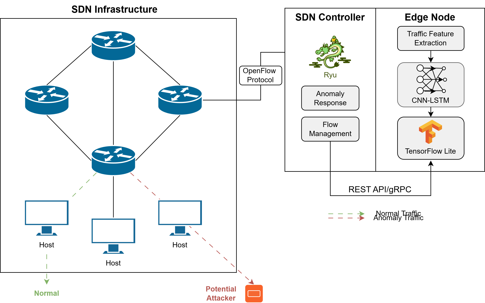
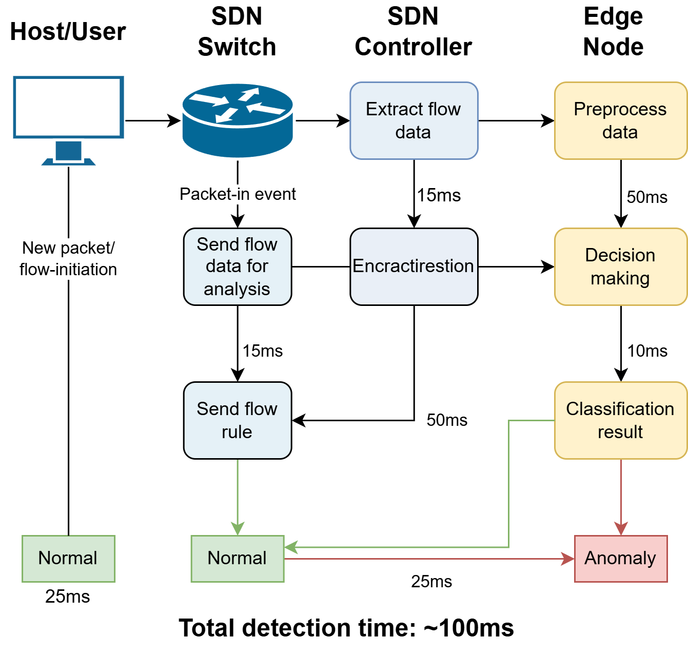

# SDN Anomaly Detector

This project implements a real-time anomaly detection system integrated into a Software Defined Network (SDN) using edge computing and deep learning. A hybrid CNN-LSTM model is trained to detect anomalies in network flows and deployed using TensorFlow Lite on edge devices. The system is integrated with a Ryu SDN controller and validated in a Mininet-based environment.

## Key Features
- Real-time anomaly detection based on live traffic.
- Hybrid CNN-LSTM model for spatio-temporal flow analysis.
- Optimized inference using TensorFlow Lite on Edge Node.
- SDN integration using OpenFlow and Ryu controller.
- Supports anomaly response actions (e.g., blocking malicious flows).

## Architecture Diagram


## CNN-LSTM Model


## Workflow


## Repository Structure
```
roor/
├── controller/
│   ├── anomaly_detection_controller.py
│   ├── sdn_topology.py
│   └── requirements.txt
├── edge-node/
│   ├── edge_inference_service.py
│   ├── model_converter.py
│   └── requirements.txt
├── model/
│   ├── train_model.py
│   ├── preprocess_dataset.py
│   └── requirements.txt
├── evaluation/
│   ├── evaluation.py
│   ├── ddos_simulator.py
│   └── requirements.txt
├── setup/
│   ├── setup_controller_vm.sh
│   ├── setup_edge_vm.sh
│   └── README.md
├── README.md
└── LICENSE
```

## Quick Start
1. Set up 2 VMs or containers: Controller (Ryu + Mininet) and Edge Node (TensorFlow Lite)
2. Install dependencies:
```bash
pip install -r requirements.txt
```
3. Start the edge inference server:
```bash
python3 edge/edge_inference.py
```
4. Run the Ryu controller app:
```bash
ryu-manager controller/simple_switch_inference.py
```
5. Launch Mininet and simulate traffic to test anomaly response.

## License
MIT License - feel free to use and adapt for research purposes.
